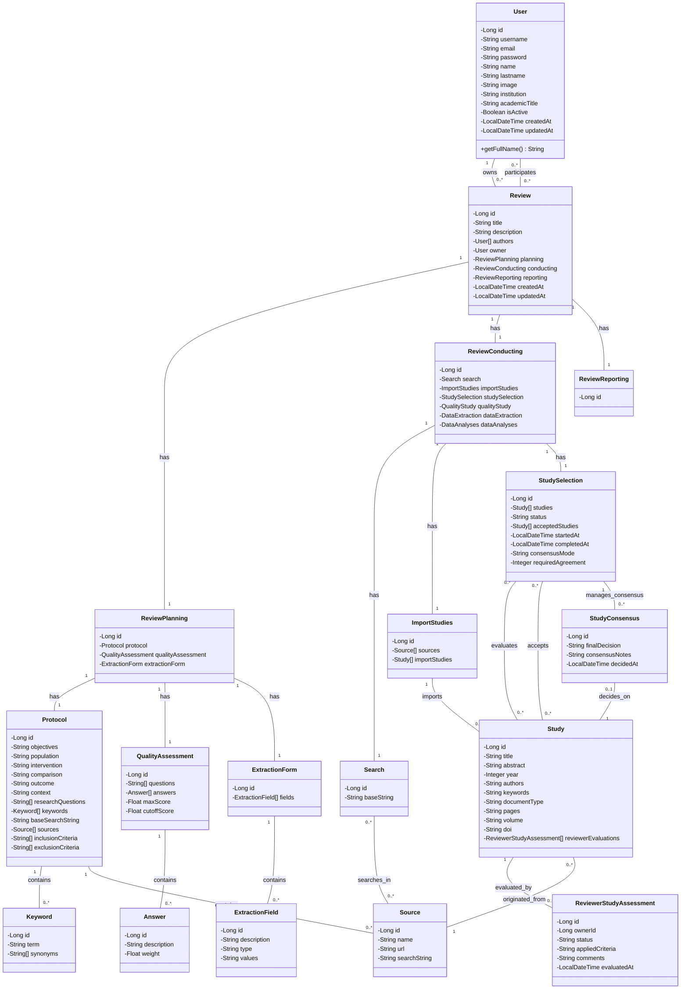

```mermaid
classDiagram
    class User {
        -Long id
        -String username
        -String email
        -String password
        -String name
        -String lastname
        -String image
        -String institution
        -String academicTitle
        -Boolean isActive
        -LocalDateTime createdAt
        -LocalDateTime updatedAt
        +getFullName() String
    }

    class Review {
        -Long id
        -String title
        -String description
        -User[] authors
        -User owner
        -ReviewPlanning planning
        -ReviewConducting conducting
        -ReviewReporting reporting
        -LocalDateTime createdAt
        -LocalDateTime updatedAt
    }

    class ReviewPlanning {
        -Long id
        -Protocol protocol
        -QualityAssessment qualityAssessment
        -ExtractionForm extractionForm
    }

    class ReviewConducting {
        -Long id
        -Search search
        -ImportStudies importStudies
        -StudySelection studySelection
        -QualityStudy qualityStudy
        -DataExtraction dataExtraction
        -DataAnalyses dataAnalyses
    }

    class Search {
        -Long id
        -String baseString
    }

    class ImportStudies {
        -Long id
        -Source[] sources
        -Study[] importStudies
    }

    class Study {
        -Long id
        -String title
        -String abstract
        -Integer year
        -String authors
        -String keywords
        -String documentType
        -String pages
        -String volume
        -String doi
        -ReviewerStudyAssessment[] reviewerEvaluations
    }

    class ReviewerStudyAssessment {
        -Long id
        -Long ownerId
        -String status
        -String appliedCriteria
        -String comments
        -LocalDateTime evaluatedAt
    }

    class StudySelection {
        -Long id
        -Study[] studies
        -String status
        -Study[] acceptedStudies
        -LocalDateTime startedAt
        -LocalDateTime completedAt
        -String consensusMode
        -Integer requiredAgreement
    }

    class StudyConsensus {
        -Long id
        -String finalDecision
        -String consensusNotes
        -LocalDateTime decidedAt
    }

    class ReviewReporting {
        -Long id
    }

    class Protocol {
        -Long id
        -String objectives
        -String population
        -String intervention
        -String comparison
        -String outcome
        -String context
        -String[] researchQuestions
        -Keyword[] keywords
        -String baseSearchString
        -Source[] sources
        -String[] inclusionCriteria
        -String[] exclusionCriteria
    }

    class QualityAssessment {
        -Long id
        -String[] questions
        -Answer[] answers
        -Float maxScore
        -Float cutoffScore
    }

    class Answer {
        -Long id
        -String description
        -Float weight
    }

    class ExtractionForm {
        -Long id
        -ExtractionField[] fields
    }

    class ExtractionField {
        -Long id
        -String description
        -String type
        -String values
    }

    class Keyword {
        -Long id
        -String term
        -String[] synonyms
    }

    class Source {
        -Long id
        -String name
        -String url
        -String searchString
    }

    User "1" -- "0..*" Review : owns
    User "0..*" -- "0..*" Review : participates
    Review "1" -- "1" ReviewPlanning : has
    Review "1" -- "1" ReviewConducting : has
    Review "1" -- "1" ReviewReporting : has
    ReviewPlanning "1" -- "1" Protocol : has
    ReviewPlanning "1" -- "1" QualityAssessment : has
    ReviewPlanning "1" -- "1" ExtractionForm : has
    ReviewConducting "1" -- "1" Search : has
    ReviewConducting "1" -- "1" ImportStudies : has
    QualityAssessment "1" -- "0..*" Answer : contains
    ExtractionForm "1" -- "0..*" ExtractionField : contains
    Protocol "1" -- "0..*" Keyword : contains
    Protocol "1" -- "0..*" Source : contains
    ImportStudies "1" -- "0..*" Study : imports
    Study "1" -- "0..*" ReviewerStudyAssessment : evaluated_by
    ReviewConducting "1" -- "1" StudySelection : has
    StudySelection "0..*" -- "0..*" Study : evaluates
    StudySelection "0..*" -- "0..*" Study : accepts
    Search "0..*" -- "0..*" Source : searches_in
    Study "0..*" -- "1" Source : originated_from
    StudySelection "1" -- "0..*" StudyConsensus : manages_consensus
    StudyConsensus "0..1" -- "1" Study : decides_on
```
