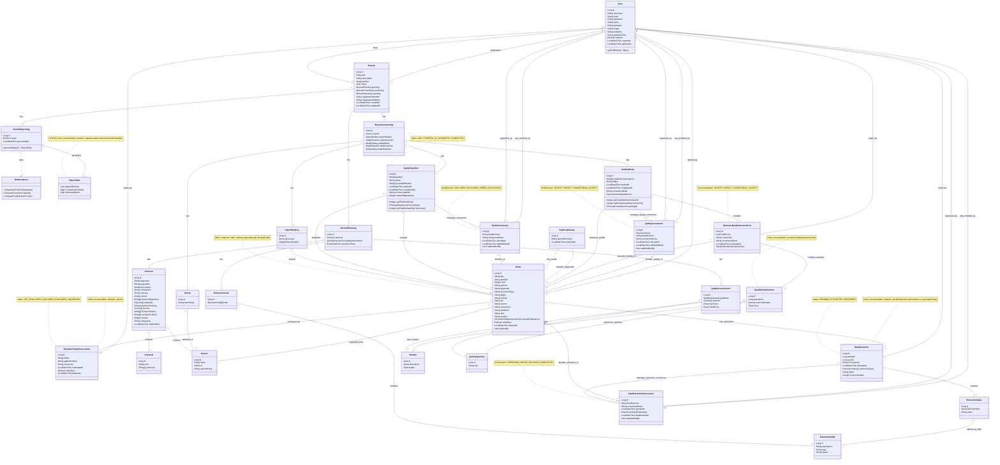

```mermaid
classDiagram
    %% Classes principais
    class User {
        -Long id
        -String username
        -String email
        -String password
        -String name
        -String lastname
        -String image
        -String institution
        -String academicTitle
        -Boolean isActive
        -LocalDateTime createdAt
        -LocalDateTime updatedAt
        +getFullName() String
    }

    class Review {
        -Long id
        -String title
        -String description
        -User[] authors
        -User owner
        -ReviewPlanning planning
        -ReviewConducting conducting
        -ReviewReporting reporting
        -String registrationNumber
        -String registrationPlatform
        -LocalDateTime createdAt
        -LocalDateTime updatedAt
    }

    class ReviewPlanning {
        -Long id
        -Protocol protocol
        -QualityAssessment qualityAssessment
        -ExtractionForm extractionForm
    }

    class ReviewConducting {
        -Long id
        -Search search
        -ImportStudies importStudies
        -StudySelection studySelection
        -QualityStudy qualityStudy
        -DataExtraction dataExtraction
        -DataAnalyses dataAnalyses
    }

    class ReviewReporting {
        -Long id
        -Review review
        -LocalDateTime generatedAt
        +generateReport() ReportData
    }

    %% Nova classe para análises de dados (gráficos, agregações)
    class DataAnalyses {
        +computeArticlesPerDatabase()
        +computeFoundVsAccepted()
        +computeFinalArticlesPerYear()
    }

    %% DTO/VO para relatório exportável
    class ReportData {
        -List<Study> analyzedArticles
        -Map<Study, List<User>> reviewersPerStudy
        -Map<String, Integer> summaryMetrics
    }

    note for ReportData "DTO/VO. Não é armazenado no banco, apenas usado para retorno/visualização."

    %% Estudos e avaliações
    class Study {
        -Long id
        -String title
        -String abstract
        -Integer year
        -String authors
        -String keywords
        -String documentType
        -String pages
        -String volume
        -String doi
        -String journal
        -String conference
        -String publisher
        -String isbn
        -String number
        -ReviewerStudyAssessment[] reviewerEvaluations
        -Boolean isDeleted
        -LocalDateTime deletedAt
        -User deletedBy
    }

    class ReviewerStudyAssessment {
        -Long id
        -String status
        -String appliedCriteria
        -String comments
        -LocalDateTime evaluatedAt
        -Boolean isDeleted
        -LocalDateTime deletedAt
    }

    note for ReviewerStudyAssessment "status: NOT_EVALUATED | INCLUDED | EXCLUDED | UNCERTAIN"
    note for ReviewerStudyAssessment "Índice recomendado: (studyId, userId)"

    class StudySelection {
        -Long id
        -Study[] studies
        -String status
        -Study[] acceptedStudies
        -LocalDateTime startedAt
        -LocalDateTime completedAt
        -String consensusMode
        -Integer requiredAgreement
        +Integer getTotalConflicts()
        +Float getAgreementPercentage()
        +Integer getStudiesNeedingConsensus()
    }

    note for StudySelection "status: NOT_STARTED | IN_PROGRESS | COMPLETED"

    class StudyConsensus {
        -Long id
        -String finalDecision
        -String consensusNotes
        -LocalDateTime decidedAt
        -LocalDateTime lastModifiedAt
        -User lastModifiedBy
    }

    note for StudyConsensus "finalDecision: INCLUDED | EXCLUDED | NEEDS_DISCUSSION"
    note for Study "Índice composto: (title, authors) para detecção de duplicatas"

    class DuplicateGroup {
        -Long id
        -String detectionCriteria
        -LocalDateTime detectedAt
    }

    %% Protocolos e formulários
    class Protocol {
        -Long id
        -String objectives
        -String population
        -String intervention
        -String comparison
        -String outcome
        -String context
        -String[] researchQuestions
        -Keyword[] keywords
        -String baseSearchString
        -Source[] sources
        -String[] inclusionCriteria
        -String[] exclusionCriteria
        -Integer version
        -String changeLog
        -LocalDateTime lastModified
    }

    class QualityAssessment {
        -Long id
        -QualityQuestion[] questions
        -Answer[] answers
        -Float maxScore
        -Float cutoffScore
    }

    class ExtractionForm {
        -Long id
        -ExtractionField[] fields
    }

    class ExtractionField {
        -Long id
        -String description
        -String type
        -String values
    }

    class ExtractionValue {
        -Long id
        -ExtractionField field
        -String value
    }

    class Keyword {
        -Long id
        -String term
        -String[] synonyms
    }

    class Source {
        -Long id
        -String name
        -String url
        -String searchString
    }

    %% Data Extraction
    class DataExtraction {
        -Long id
        -Long studyId
        -Long userId
        -Boolean extracted
        -LocalDateTime timestamp
        -ExtractionValue[] extractionValues
        -String status
        -Integer revisionNumber
    }

    note for DataExtraction "status: PENDING | EXTRACTED | REVIEWED"
    note for DataExtraction "Índice recomendado: (studyId, userId)\nGarante performance e evita duplicidade"

    class DataExtractionConsensus {
        -Long id
        -String finalDecision
        -String consensusNotes
        -LocalDateTime decidedAt
        -ExtractionValue[] finalValues
        -LocalDateTime lastModifiedAt
        -User lastModifiedBy
    }

    note for DataExtractionConsensus "finalDecision: APPROVED | NEEDS_REVISION | CONFLICTED"

    %% Avaliação de qualidade
    class QualityStudy {
        -Long id
        -Study[] studiesForAssessment
        -String status
        -LocalDateTime startedAt
        -LocalDateTime completedAt
        -String consensusMode
        -Float minimumQualityScore
        +Integer getTotalStudiesAssessed()
        +Integer getStudiesAwaitingConsensus()
        +Float getCompletionPercentage()
    }

    class ReviewerQualityAssessment {
        -Long id
        -Float totalScore
        -String comments
        -String recommendation
        -LocalDateTime evaluatedAt
        +QualityStudyAnswer[] answers
    }

    note for ReviewerQualityAssessment "recommendation: ACCEPT | REJECT | CONDITIONAL_ACCEPT"

    class QualityStudyAnswer {
        -Long id
        -Long questionId
        -Answer selectedAnswer
        -Float score
    }

    note for QualityStudyAnswer "Índice recomendado: (reviewerQualityAssessmentId)"

    class QualityConsensus {
        -Long id
        -Float finalScore
        -String finalDecision
        -String consensusNotes
        -LocalDateTime decidedAt
        -LocalDateTime lastModifiedAt
        -User lastModifiedBy
    }

    note for QualityConsensus "finalDecision: ACCEPT | REJECT | CONDITIONAL_ACCEPT"

    class Search {
        -Long id
        -String baseString
    }

    class ImportStudies {
        -Long id
        -Source[] sources
        -Study[] importStudies
    }

    class Answer {
        -Long id
        -String description
        -Float weight
    }

    class QualityQuestion {
        -Long id
        -String text
    }

    %% Relações principais
    User "1" -- "0..*" Review : owns
    User "0..*" -- "0..*" Review : participates
    Review "1" -- "1" ReviewPlanning : has
    Review "1" -- "1" ReviewConducting : has
    Review "1" -- "1" ReviewReporting : has
    ReviewReporting "1" ..> "1" DataAnalyses : uses
    ReviewReporting "1" -- "0..1" ReportData : generates
    ReviewPlanning "1" -- "1" Protocol : has
    ReviewPlanning "1" -- "1" QualityAssessment : has
    ReviewPlanning "1" -- "1" ExtractionForm : has
    ReviewConducting "1" -- "1" Search : has
    ReviewConducting "1" -- "1" ImportStudies : has
    QualityAssessment "1" -- "0..*" QualityQuestion : contains
    QualityAssessment "1" -- "0..*" Answer : contains
    ExtractionForm "1" -- "0..*" ExtractionField : contains
    Protocol "1" -- "0..*" Keyword : contains
    Protocol "1" -- "0..*" Source : contains
    ImportStudies "1" -- "0..*" Study : imports
    Study "1" -- "0..*" ReviewerStudyAssessment : evaluated_by
    ReviewConducting "1" -- "1" StudySelection : has
    StudySelection "0..*" -- "0..*" Study : evaluates
    StudySelection "0..*" -- "0..*" Study : accepts
    Search "0..*" -- "0..*" Source : searches_in
    Study "0..*" -- "1" Source : originated_from
    StudySelection "1" -- "0..*" StudyConsensus : manages_consensus
    StudyConsensus "0..1" -- "1" Study : decides_on
    ReviewerStudyAssessment "0..*" -- "1" User : made_by
    StudyConsensus "0..*" -- "1" User : registered_by
    StudyConsensus "0..*" -- "1" User : last_modified_by
    DuplicateGroup "1" -- "1" Study : has_master
    DuplicateGroup "1" -- "0..*" Study : contains_duplicates
    ReviewConducting "1" -- "1" QualityStudy : has
    QualityStudy "1" -- "0..*" ReviewerQualityAssessment : contains
    QualityStudy "0..*" -- "0..*" Study : assesses_quality
    ReviewerQualityAssessment "0..*" -- "1" User : made_by
    ReviewerQualityAssessment "0..*" -- "1" Study : assesses_quality_of
    ReviewerQualityAssessment "1" -- "0..*" QualityStudyAnswer : contains_answers
    QualityStudyAnswer "0..*" -- "1" QualityQuestion : references_question
    QualityStudyAnswer "0..*" -- "1" Answer : uses_answer
    QualityStudy "1" -- "0..*" QualityConsensus : manages_quality_consensus
    QualityConsensus "0..*" -- "1" Study : decides_quality_of
    QualityConsensus "0..*" -- "1" User : registered_by
    QualityConsensus "0..*" -- "1" User : last_modified_by
    Study "1" -- "0..*" DataExtraction : has_extractions
    User "1" -- "0..*" DataExtraction : performs
    DataExtraction "1" -- "0..*" ExtractionValue : contains
    ExtractionValue "1" -- "1" ExtractionField : references_field
    DataExtraction "1" -- "0..*" DataExtractionConsensus : manages_extraction_consensus
    DataExtractionConsensus "0..*" -- "1" Study : decides_extraction_of
    DataExtractionConsensus "0..*" -- "1" User : registered_by
    DataExtractionConsensus "0..*" -- "1" User : last_modified_by
    Study "0..*" -- "1" User : deleted_by
```
